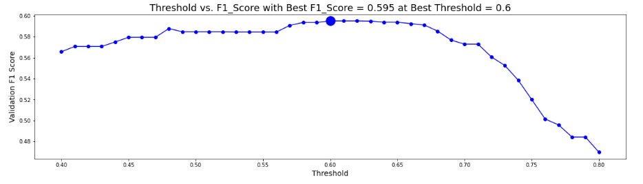
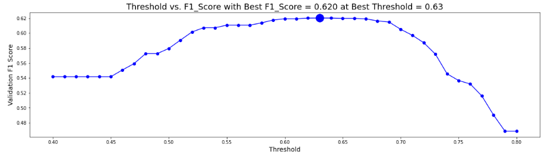
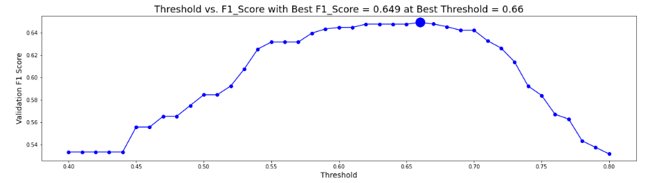

# Student Performance Prediction

We will train with 48 features and  23562 users info

Model 1 - Keras Sequential Model
Activation Function - 'elu'
Hidden dense layers = 5
Batch Normalization and Dropout Rate 20%

Model 2 - Keras Sequential Model
Activation Function - 'relu'
Dense Hidden Layers = 4
Batch Normalization and Dropout rate 50%

Model 3 - Keras Sequential Model
Activation Function - 'elu'
Hidden dense layers = 1
Dropout rate 50%

## Conclusion
We observe that Model 3 gives the best accuracy with F1_score of 0.649 when compared to Model 2 and Model 1.
We started to build a simple sequential model with 5 hidden layers and 'elu' activation function. Later after experimenting different number of layers and neurons with relu activation function, we came to a conclusion that the activation function 'elu' gives the best results. However adding more number of hidden layers was just complicating the model and over fitting to some extent.
Hence the ideal and simple model with 32neurons in input layer, 16 neurons in hidden layer and a single output layer is suffice for this dataset.